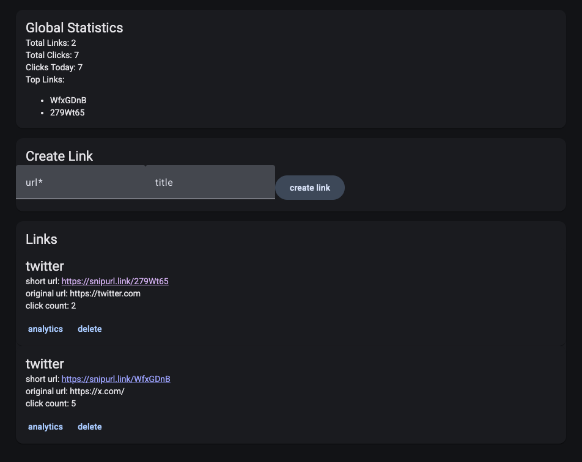
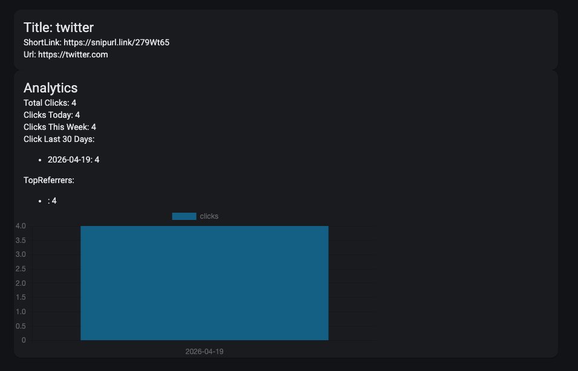

# SnipUrl — URL Shortener with Analytics

A full-stack URL shortener that lets users shorten links, share them, and track who's clicking — how many times, when, and from where.

**Live app:** [snipurl.charlesdellinger.com](https://snipurl.charlesdellinger.com)  
**Short links:** [snipurl.link](https://snipurl.link)

---

## Screenshots

### Dashboard


### Analytics


---

## Tech Stack

| Layer | Technology |
|-------|-----------|
| Frontend | Angular 21, Angular Material, ng2-charts |
| Backend | .NET 10, ASP.NET Core, Entity Framework Core |
| Database | Azure SQL (SQL Server) |
| Auth | Google OAuth 2.0 (frontend-driven), JWT |
| Hosting | Azure App Service, Azure Static Web Apps, Vercel |

---

## Features

- **Google OAuth login** — frontend-driven pattern using Google Identity Services; backend validates the ID token and issues its own JWT
- **Link management** — create, view, and delete short links with optional titles
- **Redirect middleware** — ASP.NET Core middleware intercepts short code requests before they hit the controllers, logs a click event, and returns a 302 redirect
- **Click analytics** — per-link stats including total clicks, clicks today, clicks this week, 30-day click history, and top referrers
- **Dashboard** — aggregate stats across all links with top links by click count
- **Copy button** — snackbar with one-click copy of the short URL after creation

---

## Architecture

Clean Architecture with three projects:

- **Core** — entities, interfaces, DTOs (no dependencies)
- **Infrastructure** — EF Core repositories, services, identity
- **API** — controllers, middleware, dependency injection

---

## Running Locally

### Prerequisites
- .NET 10 SDK
- Node.js 20+
- Docker (for SQL Server)

### Backend
```bash
cd backend
docker-compose up -d        # start SQL Server
dotnet user-secrets set "ConnectionStrings:DefaultConnection" "your-connection-string"
dotnet user-secrets set "Jwt:Key" "your-jwt-key"
dotnet user-secrets set "Jwt:Issuer" "your-issuer"
dotnet user-secrets set "Jwt:Audience" "your-audience"
dotnet user-secrets set "Google:ClientId" "your-google-client-id"
dotnet ef database update --project Infrastructure --startup-project API
dotnet run --project API
```

### Frontend
```bash
cd frontend
npm install
ng serve
```

---

## Key Design Decisions

- **Frontend-driven OAuth** — Angular gets the Google ID token directly via GIS, posts it to the backend, and receives an app JWT. No backend redirects or cookies.
- **Redirect middleware** — runs before controllers so short code routes never conflict with API routes. Reserved prefixes (`api/`, `swagger/`) are skipped early.
- **Vercel proxy** — short links use `snipurl.link` (Vercel) which proxies to the Azure App Service backend, enabling a clean short domain without paying for Azure custom domain SSL.
